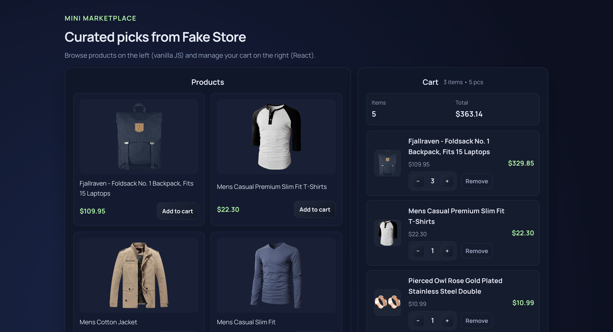
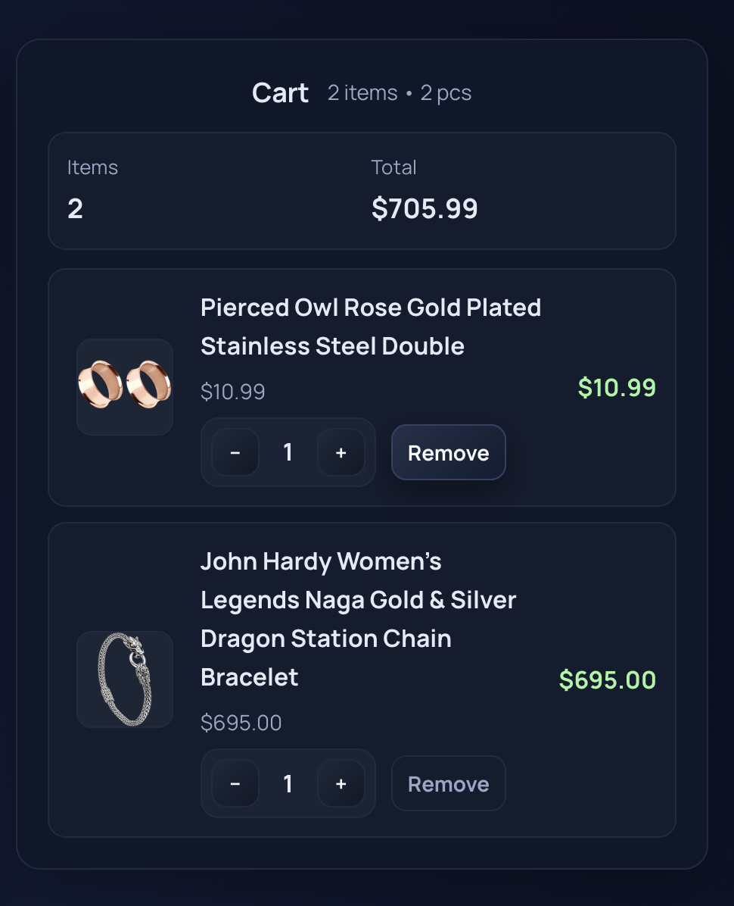

# Mini Marketplace

SPA that shows products from Fake Store (vanilla JS) and a cart managed in a React island with localStorage persistence.

## Стек

- Vite + React 18
- Каталог на чистом JS (загрузка и рендер без React)
- Корзина — React (CartList/CartItem компоненты), `useState`, `useEffect`, синхронизация через кастомное событие `cart:add`
- Чистый CSS (без UI библиотек), адаптивная сетка

## Как запустить

```bash
npm install
npm run dev  
npm run build
```

## Что реализовано

- Две секции: Products (JS) и Cart (React), на десктопе в 2 колонки, на мобилках блоки идут друг под другом.
- Каталог тянется с `https://fakestoreapi.com/products`, карточки: фото, название, цена, кнопка “Add to cart”.
- Корзина: добавление/удаление, изменение количества, подсчёт количества позиций и итоговой суммы.
- Сохранение состояния корзины в `localStorage`.
- Минимальные hover/active стили на кнопках, без сторонних UI-фреймворков.

## README по заданию

- Имя: Ansor Sadullayev
- Сколько времени заняло: ~2 часа
- Что было сложным: аккуратно развести каталожную часть на чистом JS и корзину на React, при этом синхронизировать их через события и не потерять состояние в localStorage.



